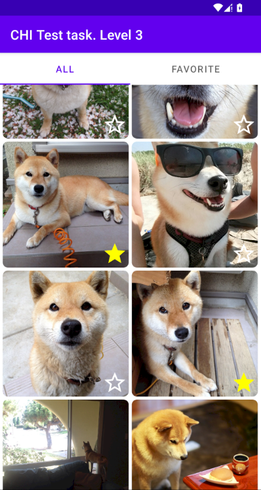

# CHI Software test task Level 2. Senior level

### Implementation details:

- Instead of having separate fields for age and date of birth, database stores
  only date of birth and app calculates current age in runtime.
- There was one breaking change in database when adding description in the last
  commit, due to description being mentioned late in the task.
- In the code, there is support for "Default" sorting, but it was not required
  by the task, so it was commented out. Can be returned by uncommenting
  line `<item>Default</item>` in arrays.xml, and moving line `DEFAULT(null),` to
  the top in the SortingType enum in MainViewModel.kt.

### Libraries and components used

- Navigation
- Room
- Lifecycle
- LiveData
- ViewModel

### Screenshots

### Download

https://github.com/retanar/Test-CHI/releases/tag/level2
